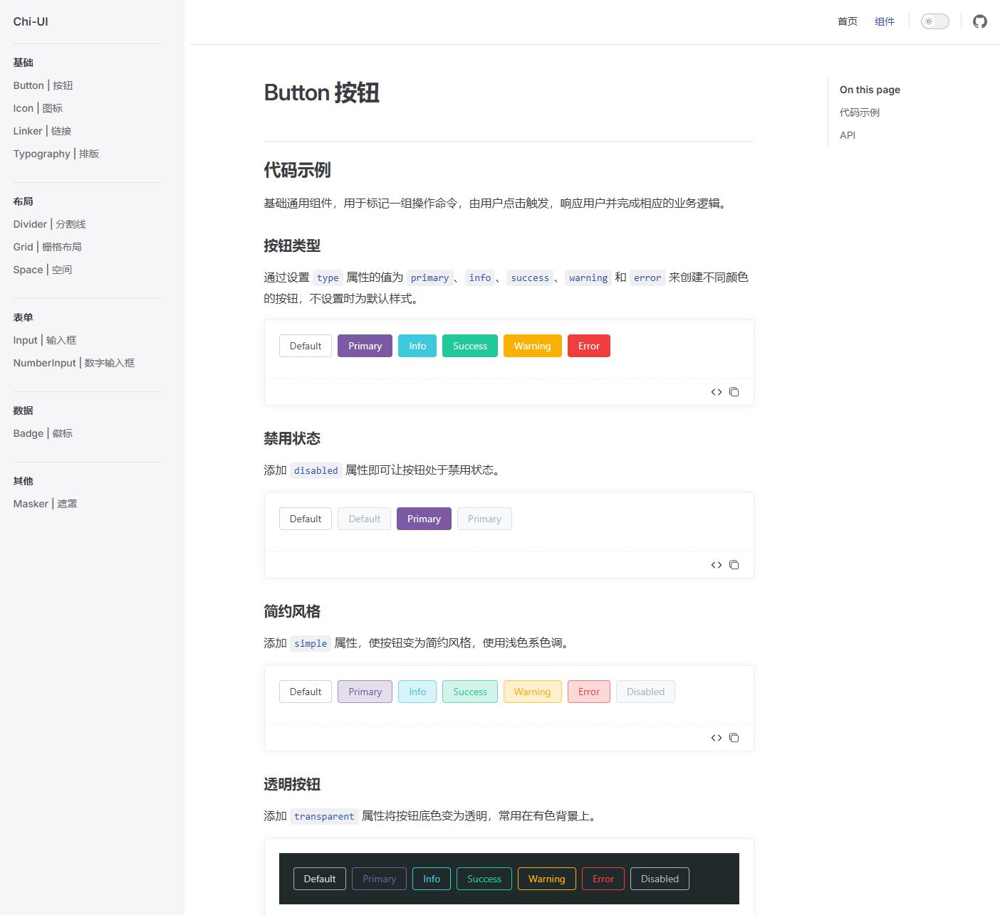

<h1 align="center">Chi UI</h1>

<p align="center">Highly Customizebility, full TypeScript</p>

**English** | [中文](./README.zh-CN.md)

This project is currently under development and has no online demo, but you could still access the documentation locally.

```bash
pnpm run docs:dev
```

---

Chi UI provides a bunch of out-of-box components.

This library is written using **composition API**, and the components are designed and written in a traditional Vue way possible, with full of **Typescript** support.

Almost all **default property values** of each component can be easily customized through injected configurations, making it easy to achieve customization.

Meanwile, the componet code pays great attention to reducing the threhold of **source code reading**, and the code layout is as close as possible to the habits of daily business code, avoiding fancy and showy code.

---

#### Some Screenshots




